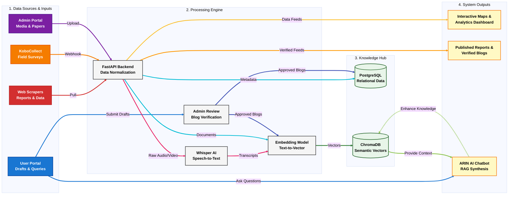

# ARIN Climate DSS - Presentation Architecture Diagram

I have updated the diagram to force a pure white background so you can easily save or screenshot it for your presentation.

```mermaid
%%{init: {'theme': 'base', 'themeVariables': { 'background': '#ffffff', 'primaryTextColor': '#000000', 'lineColor': '#000000' }}}%%
flowchart LR
    classDef autoScrape fill:#d32f2f,stroke:#b71c1c,stroke-width:2px,color:#ffffff,font-weight:bold;
    classDef autoKobo fill:#f57c00,stroke:#e65100,stroke-width:2px,color:#ffffff,font-weight:bold;
    classDef admin fill:#7b1fa2,stroke:#4a148c,stroke-width:2px,color:#ffffff,font-weight:bold;
    classDef user fill:#1976d2,stroke:#0d47a1,stroke-width:2px,color:#ffffff,font-weight:bold;
    
    classDef process fill:#f5f5f5,stroke:#424242,stroke-width:2px,color:#000000,font-weight:bold;
    classDef hub fill:#e8f5e9,stroke:#1b5e20,stroke-width:2px,color:#000000,font-weight:bold;
    classDef out fill:#fff9c4,stroke:#f57f17,stroke-width:2px,color:#000000,font-weight:bold;

    subgraph INPUTS [1. Data Sources & Inputs]
        direction TB
        Scrapers[Web Scrapers\nReports & Data]:::autoScrape
        Kobo[KoboCollect\nField Surveys]:::autoKobo
        Admin[Admin Portal\nMedia & Papers]:::admin
        Users[User Portal\nDrafts & Queries]:::user
    end

    subgraph PROCESSING [2. Processing Engine]
        direction TB
        API[FastAPI Backend\nData Normalization]:::process
        Whisper[Whisper AI\nSpeech-to-Text]:::process
        Review[Admin Review\nBlog Verification]:::process
        Embed[Embedding Model\nText-to-Vector]:::process
    end

    subgraph KNOWLEDGE_HUB [3. Knowledge Hub]
        direction TB
        Postgres[(PostgreSQL\nRelational Data)]:::hub
        Vector[(ChromaDB\nSemantic Vectors)]:::hub
    end

    subgraph OUTPUTS [4. System Outputs]
        direction TB
        Maps[Interactive Maps &\nAnalytics Dashboard]:::out
        Reports[Published Reports &\nVerified Blogs]:::out
        Chatbot[ARIN AI Chatbot\nRAG Synthesis]:::out
    end
    
    Scrapers -->|Pull| API
    Kobo -->|Webhook| API
    Admin -->|Upload| API
    Users -->|Submit Drafts| Review
    Users -->|Ask Questions| Chatbot

    API -->|Raw Audio/Video| Whisper
    Whisper -->|Transcripts| Embed
    
    API -->|Documents| Embed
    API -->|Metadata| Postgres
    
    Review -->|Approved Blogs| Embed
    Review -->|Approved Blogs| Postgres
    
    Embed -->|Vectors| Vector
    Chatbot -.->|Enhance Knowledge| Vector
    Vector -->|Provide Context| Chatbot
    
    API -->|Data Feeds| Maps
    API -->|Verified Feeds| Reports

    linkStyle 0 stroke:#d32f2f,stroke-width:3px;  
    linkStyle 1 stroke:#f57c00,stroke-width:3px;  
    linkStyle 2 stroke:#7b1fa2,stroke-width:3px;  
    linkStyle 3,4 stroke:#1976d2,stroke-width:3px; 
    
    linkStyle 5,6 stroke:#e91e63,stroke-width:3px; 
    linkStyle 7,8 stroke:#00bcd4,stroke-width:3px; 
    
    linkStyle 9,10 stroke:#3f51b5,stroke-width:3px; 
    
    linkStyle 11 stroke:#2e7d32,stroke-width:3px; 
    linkStyle 12,13 stroke:#8bc34a,stroke-width:3px; 
    
    linkStyle 14 stroke:#fbc02d,stroke-width:3px; 
    linkStyle 15 stroke:#ff9800,stroke-width:3px;
```
